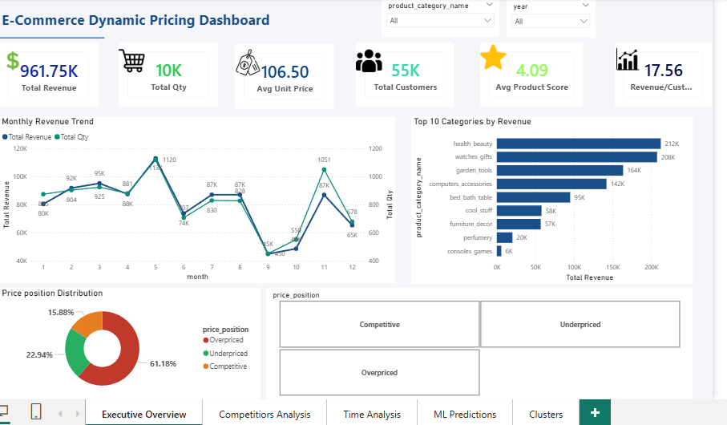
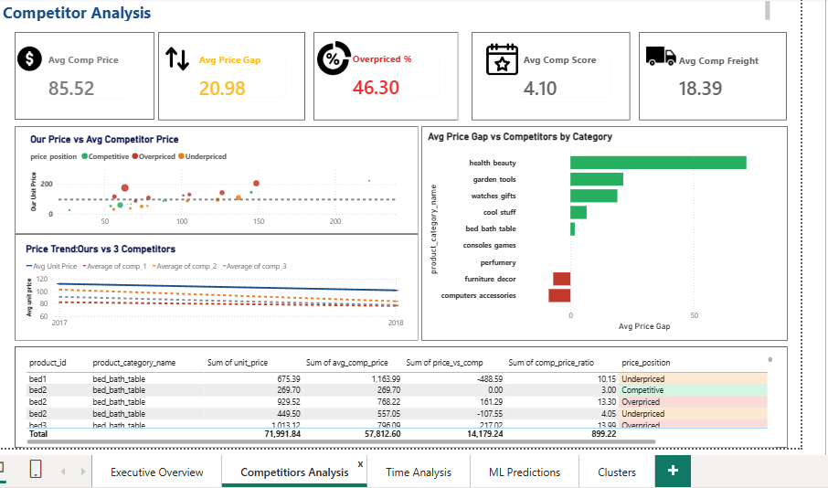
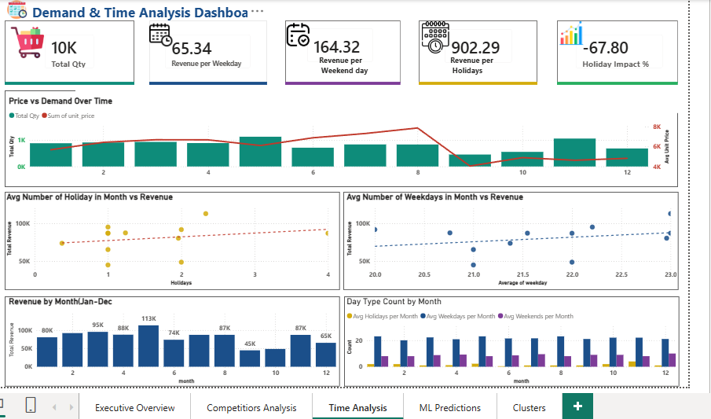
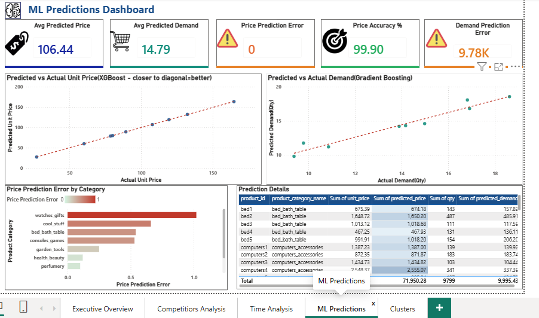
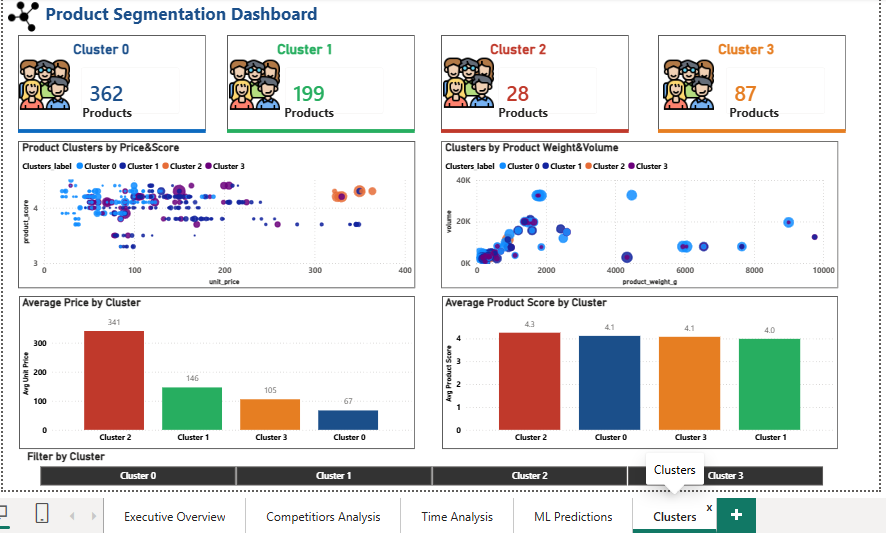
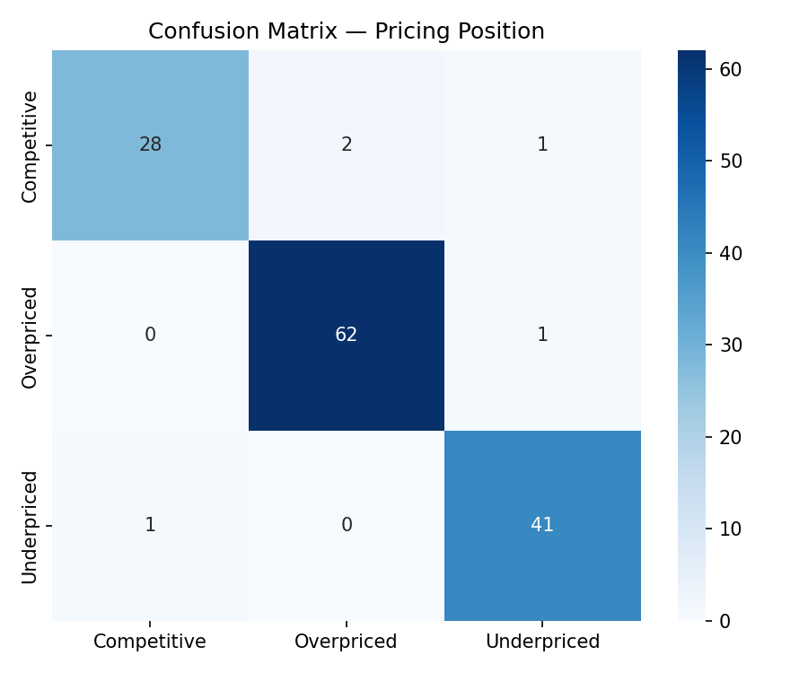
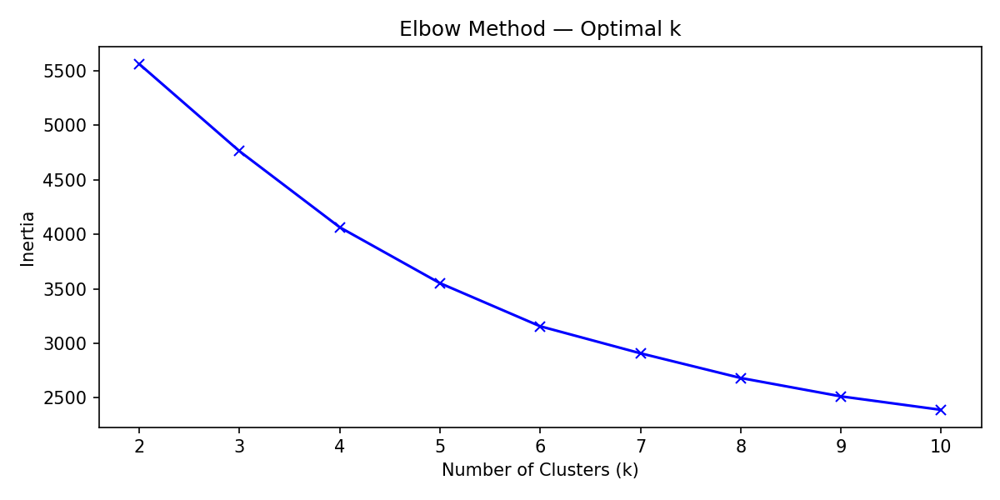
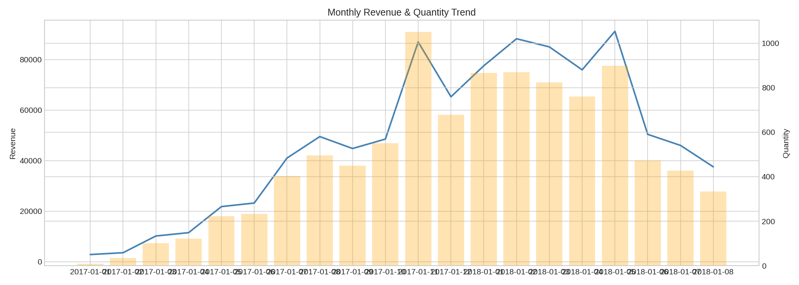

# 🛒 E-Commerce Dynamic Pricing & Demand Analysis


---

## 📌 Project Overview

An end-to-end data analytics project analyzing **676 e-commerce product
records** across **9 categories** from 2017–2018. The project covers
competitor price benchmarking, demand forecasting, product segmentation,
and pricing position classification using SQL, Python, Machine Learning,
and Power BI.

---

## 🎯 Business Problem

- Are our products **overpriced, underpriced, or competitive**
  vs 3 competitors?
- What **drives demand** — price, season, or product quality?
- Can we **predict the right price** based on market conditions?
- Which **product segments** share similar pricing characteristics?

---

## 📊 Dataset Summary

| Property | Value |
|---|---|
| Source | E-Commerce Pricing Dataset (Kaggle) |
| Rows | 676 |
| Columns | 46 (after feature engineering) |
| Time Period | January 2017 – December 2018 |
| Categories | 9 product categories |
| Competitors | 3 (comp_1, comp_2, comp_3) |

### Key Metrics

| Metric | Value |
|---|---|
| Total Revenue | ₹9,61,751 |
| Total Quantity Sold | 9,799 units |
| Total Customers | 54,775 |
| Avg Unit Price | ₹106.50 |
| Avg Product Score | 4.09 / 5.0 |
| Overpriced Products | 46.3% (313 records) |
| Underpriced Products | 30.9% (209 records) |
| Competitive Products | 22.8% (154 records) |

### Revenue by Category

| Category | Revenue |
|---|---|
| Health & Beauty | ₹2,12,409 |
| Watches & Gifts | ₹2,07,582 |
| Garden Tools | ₹1,63,583 |
| Computers & Accessories | ₹1,42,098 |
| Bed, Bath & Table | ₹95,085 |
| Cool Stuff | ₹57,956 |
| Furniture & Decor | ₹56,925 |
| Perfumery | ₹20,313 |
| Consoles & Games | ₹5,801 |

---

## 🗂️ Project Structure

ecommerce-pricing-analysis/
├── data/
│   └── ecommerce_final.csv
├── sql/
│   └── ecommerce_pricing_queries.sql
├── python/
│   ├── 01_eda_analysis.py
│   ├── 02_feature_engineering.py
│   └── 03_ml_models.py
├── powerbi/
│   ├── Ecommerce_Pricing_Dashboard.pbix
│   └── README.md
├── images/
│   ├── dashboard_page1_overview.png
│   ├── dashboard_page2_competitor.png
│   ├── dashboard_page3_demand.png
│   ├── dashboard_page4_ml.png
│   ├── dashboard_page5_segmentation.png
│   ├── confusion_matrix.png
│   ├── feature_importance.png
│   ├── elbow_curve.png
│   ├── clusters_pca.png
│   └── monthly_trend.png
├── .gitignore
└── README.md
---

## 🔧 Tech Stack

| Tool | Purpose |
|---|---|
| **SQL Server (SSMS)** | Data storage, cleaning, aggregations, views |
| **Python 3.10** | EDA, feature engineering, machine learning |
| **Pandas / NumPy** | Data manipulation |
| **Matplotlib / Seaborn** | Visualizations |
| **Scikit-learn** | Random Forest, KMeans, GBR, preprocessing |
| **XGBoost** | Best price prediction model |
| **Power BI Desktop** | Interactive 5-page dashboard |

---

## ⚙️ Machine Learning Models

### Model 1 — Price Prediction (Regression)
**Target:** `unit_price`

| Model | MAE | RMSE | R² | MAPE |
|---|---|---|---|---|
| Ridge Regression | 11.49 | 20.08 | 0.9254 | 14.65% |
| Random Forest | 3.99 | 8.71 | 0.9860 | 3.93% |
| **XGBoost** | **3.46** | **6.51** | **0.9922** | **3.61%** |

✅ XGBoost explains **99.22% of price variance** with only
±3.46 average error — selected as the final model.

### Model 2 — Demand Forecasting (Regression)
**Target:** `qty`
**Algorithm:** Gradient Boosting Regressor

Predicts how many units will be sold based on pricing,
season, competitors, and product features.

### Model 3 — Product Clustering (Unsupervised)
**Algorithm:** KMeans — k=4 selected via Elbow Method

| Cluster | Size | Profile |
|---|---|---|
| Cluster 0 | 362 products | Largest — mid range pricing |
| Cluster 1 | 199 products | Moderate price, good score |
| Cluster 2 | 28 products | Premium / outlier products |
| Cluster 3 | 87 products | Budget segment |

### Model 4 — Pricing Position Classifier
**Target:** `price_position`
**Algorithm:** Random Forest Classifier

Classifies each product as Overpriced, Competitive,
or Underpriced based on product and competitor features.

---

## 📈 Power BI Dashboard

5-page interactive dashboard built in Power BI Desktop.

### Page 1 — Executive Overview


### Page 2 — Competitor Analysis


### Page 3 — Demand & Time Analysis


### Page 4 — ML Predictions


### Page 5 — Product Segmentation


---

## 📸 ML Model Outputs

### XGBoost Feature Importance


### Confusion Matrix — Pricing Position Classifier


### KMeans Elbow Curve


### Product Clusters (PCA 2D View)


### Monthly Revenue Trend


---

## 🚀 How to Run This Project

### 1. SQL Setup
```sql
-- Open SSMS
-- Run ecommerce_pricing_queries.sql
-- All 10 queries are inside one file in order
```

### 2. Python Setup
```bash
# Install dependencies
pip install pandas numpy matplotlib seaborn scikit-learn xgboost

# Run in order
python python/01_eda_analysis.py
python python/02_feature_engineering.py
python python/03_ml_models.py
```

### 3. Power BI
- Download Power BI Desktop free from microsoft.com/power-bi
- Open powerbi/E_Commerse.pbix
- Update data source path to your local data/ecommerce_final.csv
- Click Refresh

---

## 💡 Key Insights

- **46.3% of products are overpriced** vs competitor average
  — biggest risk in garden_tools and watches_gifts categories
- **Health & Beauty** is the top revenue category at ₹2.12 lakh
- **XGBoost outperforms Ridge by 67.6% on RMSE** — confirming
  strong non-linear pricing patterns in the data
- **Months with 3+ holidays** generate significantly higher revenue
  than low holiday months
- **Cluster 2 (28 products)** are premium-priced outliers with the
  highest unit prices — best candidates for targeted pricing strategy
- **46% of products are overpriced** — direct opportunity to adjust
  pricing strategy and improve competitiveness

---

## 👤 Author

**Shajid**
Accounting Professional transitioning to Data Analytics
3 years accounting experience | IntelliPaat Certified
Skills: SQL · Power BI · Python · Machine Learning

[](https://linkedin.com/in/shajid-mk)
[](https://github.com/shajidmecheri1996)

---

## 📄 License

This project is for portfolio and educational purposes.
Dataset sourced from Kaggle — E-Commerce Pricing Dataset.
